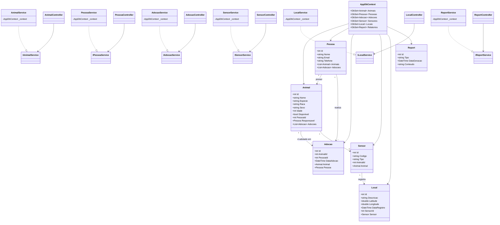

# FindMyPet Api DotNet

**FindMyPet Api DotNet** é uma API desenvolvida em .NET para o sistema **de resgate e adoção de animais em desastres**. A plataforma permite mapear animais resgatados, registrar denúncias de animais perdidos, gerenciar processos de adoção (temporária ou definitiva) e integrar sensores de movimento em áreas de risco. A solução é modularizada em camadas e utiliza Entity Framework Core com banco de dados Oracle. Conta também com documentação interativa via Swagger.

---

## 📌 Funcionalidades

- Gerenciamento de **usuários**
- Cadastro e mapeamento de **animais resgatados**
- Registro de **denúncias de animais perdidos**
- Processo de **adoção temporária ou definitiva**
- Monitoramento de áreas de risco com **sensores de movimento**
- API RESTful com respostas em JSON
- Documentação interativa via Swagger
- Integração com Oracle via Entity Framework Core
- Migrações de banco com EF Core

---

# 👩‍💻 Participantes

- Pedro Henrique Mendonça de Novais - RM555276
- Davi Alves de Lima - RM556008
- Rodrigo Alcides Bohac Ríos - RM554826

---

## 🏗 Estrutura do Projeto

- **api**: Camada de apresentação (controllers, Swagger, configurações iniciais)
- **service**: Camada de regras de negócio (serviços e lógica da aplicação)
- **data**: Acesso a dados e contexto do banco (AppDbContext, migrations)
- **library**: Camada de domínio (entidades e modelos do sistema)

---

## 💻 Tecnologias Utilizadas

- .NET 8 / .NET 9
- ASP.NET Core Web API
- Entity Framework Core
- Oracle.EntityFrameworkCore
- Swagger / Swashbuckle
- C#

---

## 🚀 Como Executar o Projeto

Clone o repositório:

```bash
git clone https://github.com/seu-usuario/findmypet-api-dotnet
cd findmypet-api-dotnet
```

Restaure os pacotes:

```bash
dotnet restore
```

Aplique as migrations:

```bash
dotnet ef database update --project ./data --startup-project ./api
```

Execute a aplicação:
```bash
cd api
dotnet run
```

Acesse a documentação Swagger:
```bash
https://localhost:{porta}/swagger
```

## 📬 Endpoints da API

### 🔹 Usuários (`/api/Usuario`)

| Método | Rota                         | Descrição                   |
|--------|------------------------------|-----------------------------|
| GET    | `/api/Usuario`               | Lista todos os usuários     |
| GET    | `/api/Usuario/{id}`          | Retorna um usuário por ID   |
| POST   | `/api/Usuario`               | Cria um novo usuário        |
| PUT    | `/api/Usuario/{id}`          | Atualiza um usuário         |
| DELETE | `/api/Usuario/{id}`          | Remove um usuário           |

---

### 🔹 Animais Resgatados (`/api/AnimalResgatado`)

| Método | Rota                                   | Descrição                             |
|--------|----------------------------------------|---------------------------------------|
| GET    | `/api/AnimalResgatado`                 | Lista todos os animais resgatados     |
| GET    | `/api/AnimalResgatado/{id}`            | Retorna um animal resgatado por ID    |
| POST   | `/api/AnimalResgatado`                 | Registra um novo animal resgatado     |
| PUT    | `/api/AnimalResgatado/{id}`            | Atualiza informações de um animal     |
| DELETE | `/api/AnimalResgatado/{id}`            | Remove um registro de animal          |

---

### 🔹 Denúncias de Animais Perdidos (`/api/Denuncia`)

| Método | Rota                         | Descrição                                 |
|--------|------------------------------|-------------------------------------------|
| GET    | `/api/Denuncia`              | Lista todas as denúncias de animais perdidos |
| GET    | `/api/Denuncia/{id}`         | Retorna uma denúncia por ID               |
| POST   | `/api/Denuncia`              | Registra uma nova denúncia                |
| PUT    | `/api/Denuncia/{id}`         | Atualiza uma denúncia                     |
| DELETE | `/api/Denuncia/{id}`         | Remove uma denúncia                       |

---

### 🔹 Adoções (`/api/Adocao`)

| Método | Rota                         | Descrição                           |
|--------|------------------------------|-------------------------------------|
| GET    | `/api/Adocao`                | Lista todos os processos de adoção  |
| GET    | `/api/Adocao/{id}`           | Retorna um processo de adoção por ID|
| POST   | `/api/Adocao`                | Inicia um novo processo de adoção   |
| PUT    | `/api/Adocao/{id}`           | Atualiza um processo de adoção      |
| DELETE | `/api/Adocao/{id}`           | Remove um processo de adoção        |

---

### 🔹 Sensores de Movimento (`/api/SensorMovimento`)

| Método | Rota                                  | Descrição                              |
|--------|---------------------------------------|----------------------------------------|
| GET    | `/api/SensorMovimento`                | Lista todos os sensores de movimento   |
| GET    | `/api/SensorMovimento/{id}`           | Retorna um sensor por ID               |
| POST   | `/api/SensorMovimento`                | Cadastra um novo sensor de movimento   |
| PUT    | `/api/SensorMovimento/{id}`           | Atualiza um sensor existente           |
| DELETE | `/api/SensorMovimento/{id}`           | Remove um sensor                       |

---

## 📊 Diagrama da Arquitetura


